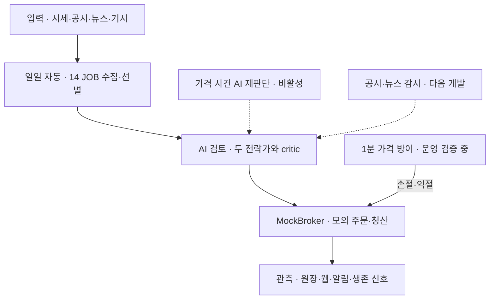

# Quantinue MVP-2 2주차 구현 활동 보고서

| 항목 | 내용 |
|---|---|
| 보고 기간 | 2026-07-18 ~ 2026-07-23 |
| 대상 | Quantinue MVP-2 |
| 팀 | 여름이었다 |
| 한 줄 결론 | **하루 한 번 실행되던 시연형 파이프라인을 자동 복구와 관측이 가능한 모의투자 운영 시스템으로 확장했다.** |

## 1. 먼저 보는 핵심 요약

Quantinue는 시장 데이터와 공시·뉴스를 수집하고, AI 전략가와 독립 비평가가 투자 후보를 검토한 뒤 **MockBroker 모의 계좌**에서만 주문과 청산을 수행하는 시스템이다. 실제 증권 계좌에는 주문하지 않는다.

이번 주에는 일일 분석 체인을 14개 독립 작업으로 나누고, 모의 매매·장중 가격 방어·비용 통제·웹 관제·장애 알림을 연결했다.

| 현재 상태 | 의미 |
|---|---|
| **완료** | 일일 JOB 체인, 데이터 수집·후보 선별, 전략가와 독립 비평가(critic), MockBroker 모의 매매, 관리자·사용자 웹, 안전장치 |
| **운영 검증 중** | 1분 가격 조회와 손절·익절 방어 |
| **구현 완료·비활성** | 가격 사건·정기 시각 기반 AI 재판단, 매수·매도·보류 결정과 자동 모의 집행, 보유 종목 실시간 스트림 |
| **다음 개발** | 장중 신규 공시·뉴스·와이어 증분 수집과 관련 종목 재판단 |
| **보류** | AWS 이전. 로컬 정규장 검증을 마친 뒤 결정 |

> 이 보고서에서 “완료”는 기능 구현과 검증이 끝났다는 뜻이다. 실제 시장 운영에서 장기간 안정성이 확인됐다는 뜻은 아니다.

## 2. 시스템은 어떻게 움직이는가

일일 전체 분석은 한 번 실행한다. 대신 장중에는 모든 과정을 반복하지 않고, 가격 변화나 새 공시·뉴스처럼 **새로운 사건이 생겼을 때 관련 종목만 다시 판단**하는 구조로 발전시키고 있다.

장중 AI 재판단은 관련 종목을 **매수·매도·보류** 중 하나로 결정한다.

| 판단 | 자동 처리 |
|---|---|
| 매수 | 위험·예산 검사를 통과하면 장중 배분과 MockBroker 모의 매수로 연결 |
| 매도 | 독립 비평가가 승인하면 보유 포지션의 MockBroker 모의 청산으로 연결 |
| 보류 | 주문하지 않고 기존 포지션 유지 |

이 판단과 후속 모의 집행 경로는 구현돼 있지만 현재 운영에서는 비활성이다. 지금 활성화된 장중 동작은 1분 가격 조회와 손절·익절 방어 매도다.

최종 목표 주기는 다음과 같다.

| 대상 | 권장 주기 | 처리 방식 |
|---|---:|---|
| 일일 전체 체인 | 거래일 1회 | 전체 데이터 갱신과 후보 선정 |
| 가격 | 1분 | 손절·익절 등 결정론적 방어 |
| SEC 공시 | 30분 | 새 공시만 증분 수집 |
| 일반 뉴스 | 15분 | 새 기사만 증분 수집 |
| 뉴스 와이어 | 10분 | 속보성 피드만 증분 수집 |

새로운 관련 사건이 없다면 사건 기반 AI 호출도 발생하지 않는다.

## 3. 1주차에서 무엇이 달라졌는가

| 구분 | 1주차 | 2주차 |
|---|---|---|
| 실행 방식 | 01~11단계 단일 파이프라인 | 14개 독립 JOB과 잡별 재시도 |
| 자동 실행 | 수동·단일 실행 중심 | NYSE 거래일과 실행 시각 기준 자동 실행 |
| AI 판단 | 공격형 전략 중심 | 공격형·보수형 전략가와 성향별 독립 비평 |
| 데이터 | SEC 공시·뉴스 중심 | 시세·SPY·Form 4·뉴스·와이어·FRED까지 확대 |
| 모의 매매 | 기본 주문 흐름 | 매수·청산·배분과 주문 계보 연결 |
| 장중 대응 | 없음 | 1분 가격 방어와 선택적 재판단 기반 구현 |
| 운영 화면 | 단일 시연 화면 | 관리자 관제와 사용자 읽기 화면 분리 |
| 장애 감지 | 운영자가 직접 확인 | Telegram 알림과 외부 생존 신호(heartbeat) |
| 비용 관리 | 추정 중심 | 호출별 원장, 예산 예약, 일일 상한 |

가장 큰 변화는 기능의 수가 아니라 **실패한 작업만 다시 실행하고, 중복 비용과 중복 주문을 막으며, 결과를 원장에서 추적할 수 있게 된 것**이다.

## 4. 이번 주 구현 내용

### 4.1 독립 JOB과 데이터 원장

- 유니버스, 시세, 공시, 뉴스, 거시, 선별, 전략 분석, 청산, 배분 등을 14개 JOB으로 분리했다.
- NYSE 거래일과 뉴욕 날짜의 실행 시각(slot)을 기준으로 자동 기동한다.
- `tb_job_run` 원장이 같은 실행 시각의 중복 실행을 차단한다.
- 한 JOB이 실패해도 성공한 작업은 보존하고 실패 지점부터 재개할 수 있다.
- 운영 DB 연결 기준은 `127.0.0.1:5445`로 통일했다.

### 4.2 데이터 수집과 AI 판단

- NASDAQ 유니버스, Alpaca 시세·뉴스, SEC 공시·Form 4, FRED 금리, RSS/Atom 와이어를 연결했다.
- 기술 지표로 후보를 선별한 뒤 공격형·보수형 전략가가 각각 분석한다.
- 독립 비평가(critic)는 전략가의 근거와 위험을 다시 검토해 승인하거나 기각한다.
- 모델, 토큰, 비용, 판단 근거와 입력 출처를 원장에 남긴다.

### 4.3 MockBroker 모의 매매

- 승인된 후보에 현금·포지션·일일 매수 한도와 위험 정책을 적용한다.
- 손절·익절 조건을 포함한 모의 매수와 청산·재배분을 연결했다.
- 주문 직전에 거래 가능 여부를 다시 확인한다.
- 확인 결과가 거짓이거나 오류·시간 초과·불명 상태이면 신규 매수를 차단한다.

모든 주문과 체결은 **MockBroker 내부의 모의 처리**다. 실제 투자금이나 증권 계좌를 사용하지 않는다.

### 4.4 장중 가격 감시

| 기능 | 상태 |
|---|---|
| 정규장 여부 확인과 1분 가격 조회 | 구현, 운영 적용 확인 중 |
| 같은 주기 안의 손절·익절 모의 청산 | 구현 완료 |
| ±5% 가격 변화 시 AI 재판단 | 구현 완료, 비활성 |
| 뉴욕 10:00·12:45·15:15 정기 재점검 | 구현 완료, 비활성 |
| 관리자 장중 판단 화면 | 구현 완료 |
| 보유 종목 웹소켓과 1분 폴링 혼합 | 구현 완료, 비활성 |

손절·익절은 AI 없이 코드가 판단한다. 비용이 발생하는 AI 재판단은 가격 사건이나 정기 재점검이 있을 때만 수행하며, 30분 cooldown과 예산 제한을 적용한다. 재판단 결과가 매수면 장중 배분·모의 매수, 매도면 모의 청산으로 자동 연결되고, 보류면 주문 없이 기존 포지션을 유지한다. 이 AI 재판단·집행 기능은 현재 비활성이다.

### 4.5 관제와 장애 대응

- `8020`: JOB, 가격 감시, 외부 생존 신호를 소유하는 운영 인스턴스
- `8021`: 백그라운드 작업 없이 화면만 제공하는 개발 인스턴스
- Telegram: 기동, 실패, 일일 결과, 방어선 작동 등 내부 상태 알림
- 외부 생존 신호(heartbeat): 앱이 완전히 멈춰 Telegram도 보내지 못하는 상황을 감지
- 실행권한·세대 검증(lease·fencing): 오래된 실행이 다시 살아나 중복 판단이나 주문을 만드는 문제 방지
- 부분 실패 재개: 이미 성공한 결과는 재사용하고 미완료 단계만 다시 실행

Wi-Fi 변경과 서버 이동으로 일부 실시간 관측이 누락됐다. 따라서 코드와 설정의 존재뿐 아니라 운영 인스턴스, 최근 실행 기록, DB 원장, 외부 생존 신호 기록을 함께 확인한다.

## 5. 검증 결과

| 검증 항목 | 결과 |
|---|---|
| 14개 JOB 등록과 실행 시각 중복 방지 | 통과 |
| 데이터 수집부터 후보 선별까지의 원장 연결 | 통과 |
| 공격형·보수형 전략가와 독립 비평가 분리 | 통과 |
| MockBroker 매수·청산·배분 계보 | 통과 |
| 거래 가능 여부 불명 시 신규 주문 차단 | 통과 |
| AI 비용 예약·일일 상한·동시성 방어 | 통과 |
| 관리자 쓰기와 사용자 읽기 권한 분리 | 통과 |
| 재시작·부분 실패·중복 실행 방어 | 통과 |
| 장중 가격 감시의 실제 정규장 연속 운영 | 추가 관측 필요 |
| 장중 공시·뉴스 사건 경로 | 미구현 |

검증 대상은 투자수익이 아니라 **자동 실행, 추적 가능성, 비용 통제, 중복 방지와 장애 복구**다.

## 6. 비용과 배포 판단

### LLM 비용

- 2026-07-22 실측: 43회 호출, 입력 70,491토큰, 출력 8,745토큰
- Standard 요율 보정 비용: 약 **$0.092**
- 장중 사건 경로까지 활성화한 예상 비용: 하루 **$0.40~0.50**
- 10거래일 예상 비용: **$4~5**
- 코드상 일일 하드캡: **$3**

실제 비용은 공시·뉴스 발생량에 따라 달라진다. 새 관련 사건이 없을 때 AI를 호출하지 않는 것이 비용 설계의 핵심이다.

### AWS 최소안

AWS 이전은 아직 실행하지 않았다. 로컬 운영 검증 후 Lightsail 2GB 한 대를 사용하는 경우 월 **약 $13~15**를 최소안으로 예상한다.

## 7. 남은 과제와 다음 주 계획

다음 목표는 전체 분석을 자주 반복하는 것이 아니라, **장중에 새로 들어온 사건만 처리하는 경로**를 완성하는 것이다.

1. 공시·기사 원문, 수집 위치(cursor), 사건, 처리 영수증을 덮어쓰지 않는 원장으로 저장한다.
2. SEC 공시 30분, 일반 뉴스 15분, 와이어 10분 주기의 증분 수집을 연결한다.
3. 중복·중요도·관련 종목을 코드로 먼저 판단해 불필요한 AI 호출을 막는다.
4. 12,000자 이하 원문은 제한된 증거팩으로 직접 전달하고, 긴 문서만 요약을 캐시한다.
5. 관련된 보유 종목과 당일 후보만 전략가와 독립 비평가에게 다시 전달한다.
6. 판단이 실제로 바뀐 경우에만 기존 모의 청산·배분 경로를 호출한다.
7. 무사건 0회 호출, 중복 사건 0회 재처리, 관련 사건 1회 판단을 검증한다.
8. 정규장 1~2거래일의 운영 증거가 쌓인 뒤 AWS 이전 여부를 결정한다.

## 8. 주요 리스크

| 리스크 | 대응 |
|---|---|
| 구현 완료를 운영 안정성으로 오해 | 기능 상태와 실제 운영 관측 상태를 분리해서 기록 |
| 운영·개발 인스턴스의 중복 실행 | `8020`만 백그라운드 작업을 소유 |
| 동시에 발생한 AI 호출의 예산 초과 | 호출 전 비용 예약과 일일 `$3` 상한 |
| 오래된 실행의 중복 판단·주문 | 실행권한 갱신과 세대 검증(lease·fencing) |
| 기사 안의 악성 명령 | 기사는 신뢰하지 않는 데이터로만 처리 |
| 장중 신규 사건 대응 지연 | 공시·뉴스·와이어 증분 경로를 다음 개발 우선순위로 지정 |
| 비밀정보 노출 | 실제 계정, URL, 토큰, 이메일, 운영 IP를 문서와 일반 로그에서 제외 |

## 9. 역할 구분

| 역할 | 주요 책임 |
|---|---|
| PM·인프라 | 범위, DB, 실행 소유권, 운영 Gate |
| 데이터 수집 | 시세·공시·뉴스 수집과 데이터 품질 |
| 전략 | 공격형·보수형 판단과 재판단 기준 |
| 비평·검증 | 독립 비평, 비용·중복·주문 안전성 검토 |
| 리뷰·회고 | 체결·청산 원장과 성과 표시 검토 |

## 10. 참고 문서

- [1주차 구현 활동 보고서](https://github.com/jaymunsh/quantinue/blob/main/docs/weekly-report-fist-week.md)
- [MVP-2 개발 현황과 전체 계획](https://github.com/jaymunsh/quantinue/blob/main/docs/mvp2-planning/project-status-and-roadmap.md)
- [장중 가격 감시 설계](https://github.com/jaymunsh/quantinue/blob/main/docs/mvp2-planning/intraday-realignment.md)
- [장중 신규 사건 재판단 계획](https://github.com/jaymunsh/quantinue/blob/main/docs/mvp2-planning/intraday-event-reassessment-plan.md)
- [운영 런북](https://github.com/jaymunsh/quantinue/blob/main/docs/operations-runbook.md)
- [통합 설계서](https://github.com/jaymunsh/quantinue/blob/main/docs/quantinue-integrated-design.html)
- [기술 부록](https://github.com/jaymunsh/quantinue/blob/main/docs/quantinue-engineering.html)
- [하루의 흐름](https://github.com/jaymunsh/quantinue/blob/main/docs/quantinue-day-anatomy.html)

## 11. 결론

2주차에는 Quantinue를 단일 시연 파이프라인에서 **독립 JOB, 추적 가능한 원장, 다중 AI 검토, MockBroker 모의 매매, 장중 가격 방어와 장애 감시를 갖춘 운영형 MVP-2**로 확장했다.

일일 전체 체인은 자동화됐고 장중 가격 감시 기반도 구현됐다. 다만 실제 정규장에서의 연속 관측과 장중 신규 공시·뉴스 사건 경로는 아직 남아 있다. 다음 주에는 이 두 항목을 검증해, “코드가 존재하는 상태”에서 “사람의 반복 조작 없이 안전하게 운영되는 상태”로 마무리한다.
